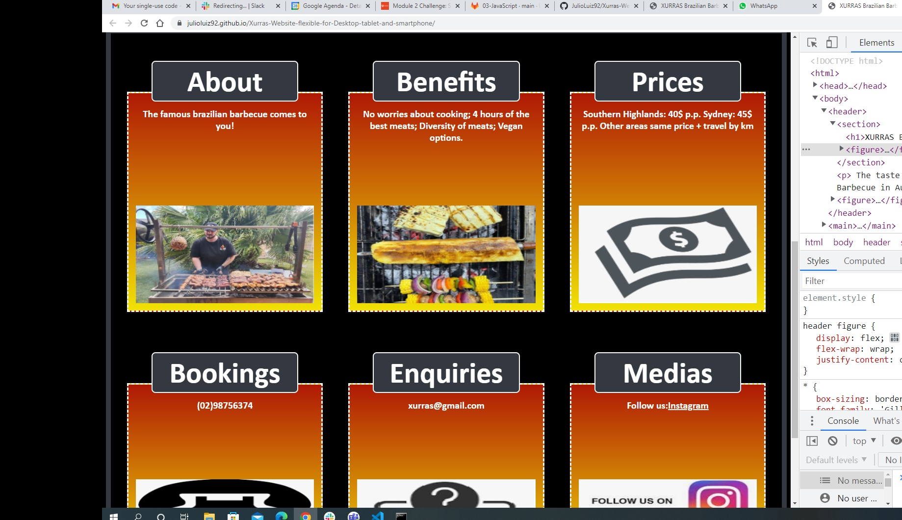
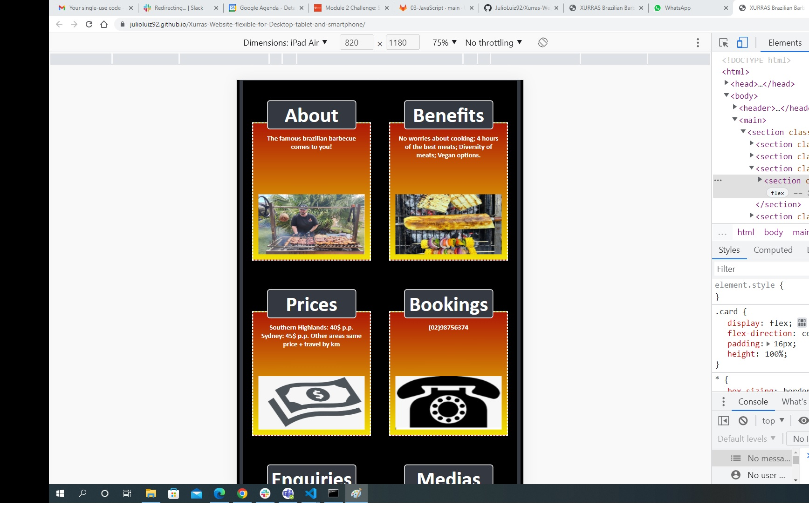
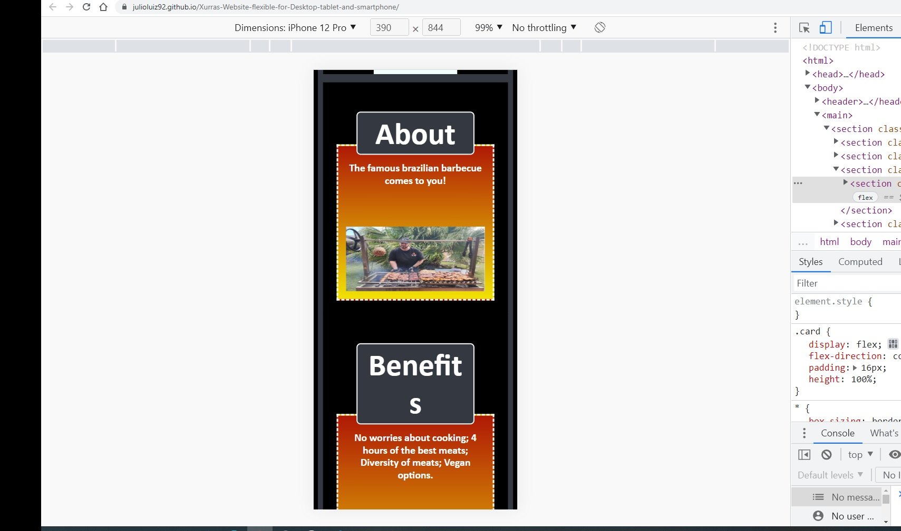

# Xurras-Website-flexible-for-Desktop-tablet-and-smartphone
Xurras Website: flexible for Desktop, tablet and smartphone

This webpage has been built holding a collection of CSS snippets:

- responsive grid;

- clear headings;

- highlight a code snippet by clicking on it;

- use of semantic HTML elements and proper indentation;

- clean and reusable values for a color scheme;

- flexbox and media queries created a responsive grid layout;

- background color using a CSS linear-gradient function;

- animation using the CSS transition property;

  * At size 992px and above, the app resembles the following image:

    

  * At size 768px and above, the app resembles the following image:

    

  * On mobile devices, anything under 768px, the app resembles the following image:

    

Follow the links for the deployed applications:

https://julioluiz92.github.io/Xurras-Website-flexible-for-Desktop-tablet-and-smartphone/

https://github.com/JulioLuiz92/Xurras-Website-flexible-for-Desktop-tablet-and-smartphone